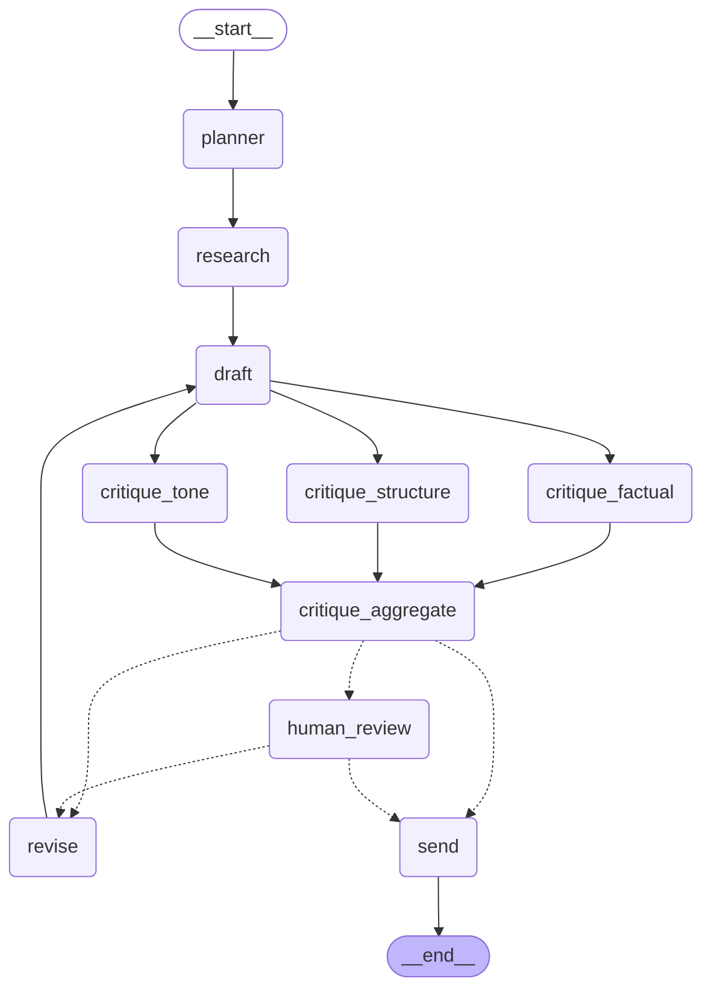

# Autonomous Newsletter Agent

[](https://github.com/YOUR_USERNAME/YOUR_REPO/actions/workflows/ci.yml)
_(swap in your actual GitHub username/repo once pushed — the badge is wired to `.github/workflows/ci.yml`, which already exists in this project)_

A LangGraph-based agent that takes the plain-English goal *"Create a weekly
newsletter on latest AI agent news and send it to our subscribers"* and
autonomously plans, researches, drafts, critiques, and (simulated-)sends a
newsletter — with an optional Human-in-the-Loop approval gate.

## 1. Architecture Blueprint

The agent is a **LangGraph `StateGraph`**, not a single prompt loop. Every
node reads a shared `NewsletterState` dict and returns a partial update;
LangGraph merges it and moves to the next node per the edges below.

```
START
  │
  ▼
planner            "Break the goal into a plan + 3 search queries" (LLM)
  │
  ▼
research           tool: web_search_tool  → up to 7 deduped articles
  │
  ▼
draft              tool: html_newsletter_tool → summarizes each article (LLM),
  │                writes subject + Markdown + HTML draft
  │
  ├──────────────┬──────────────────┐
  ▼              ▼                  ▼
critique_       critique_        critique_          three specialists run
factual         tone             structure          concurrently (fan-out),
  │              │                  │                each scoring ONE dimension
  └──────────────┴──────────────────┘
                 ▼
        critique_aggregate     avg>=8 AND weakest>=6 required to approve
                 │             (a floor, not a flat average — see nodes.py)
  ├─ mode == "hitl" and no human decision yet ──────────► human_review
  │                                                            │
  │                                                   interrupt() pauses here;
  │                                                   caller shows the draft +
  │                                                   full critic breakdown and
  │                                                   asks for approve / revise
  │                                                            │
  │                                                   ┌────────┴────────┐
  │                                                   │                 │
  │                                              approve            revise
  │                                                   │                 │
  │                                                   ▼                 ▼
  ├─ approved OR revision_count >= MAX_REVISIONS ──► send            revise
  │                                                                     │
  └─ otherwise ─────────────────────────────────────────────────────► revise
                                                                        │
                                                                        ▼
                                                                     draft (loop)

send               tool: save_email_tool → writes .html/.md to outputs/,
  │                prints subject + body (the "simulated send")
  ▼
 END
```

The diagram above is hand-annotated to explain *why* each edge exists. Below
is the actual topology, generated directly from the compiled graph object
(`scripts/generate_diagram.py`) rather than hand-drawn — so it can never
silently drift from the real code as nodes/edges change (GitHub renders this
fence natively):



Key design points:

- **Multi-step reasoning** maps 1:1 onto assignment stages: `planner`
  (planning) → `research` (research) → `draft` (writing) → three parallel
  critics + `critique_aggregate` + `human_review` (review) → `send` (output).
- **Self-reflection is a multi-critic ensemble**, not one LLM call judging
  everything at once. `critique_factual`, `critique_tone`, and
  `critique_structure` each score one dimension independently and run
  concurrently (real parallelism — LangGraph fans them out with no data
  dependency between them). `critique_aggregate` fans them back in and
  requires **average ≥ 8 AND weakest individual score ≥ 6** to approve — a
  flat average would let one bad dimension hide behind two lenient scores;
  the floor forces every dimension to clear a minimum bar independently,
  the way a real editorial board works. Below that bar, it routes to
  `revise` → back to `draft`, capped at `MAX_REVISIONS = 2` so it can't
  loop forever.
- **Human-in-the-Loop**: implemented with LangGraph's native `interrupt()`
  primitive plus a SQLite checkpointer (see Persistence below). In `hitl`
  mode, `critique_aggregate` always routes to `human_review` first;
  `human_review` calls `interrupt()`, which genuinely pauses the graph and
  returns control (and the full three-critic breakdown) to the caller. The
  caller resumes with `Command(resume={"decision": "approve"})` or
  `Command(resume={"decision": "revise", "feedback": "..."})`. On revision,
  `human_decision` is reset to `None` so the *next* draft is routed back
  through a fresh human review rather than auto-sending.
- **Fully Autonomous mode** simply skips `human_review` entirely — the
  state machine runs start to finish on its own.
- **Persistence**: the checkpointer is a real SQLite file (`checkpoints.sqlite`),
  not just in-memory, so a paused HITL run survives an app restart. This is
  *not* automatic in the browser, though — Streamlit's `session_state` (which
  holds the current thread ID) resets on a real restart even though the
  checkpoint itself doesn't. The sidebar shows your current thread ID and has
  a **"Resume a paused session"** box: copy the ID before closing the app,
  paste it back in later, and it reconstructs the exact paused draft,
  critique breakdown, and reasoning log from disk — verified by actually
  killing the connection and rebuilding the graph from scratch mid-test, not
  just re-calling the same in-memory object.

## 2. Tools (3 total)

| Tool | Purpose |
|---|---|
| `web_search_tool` | Searches for AI agent news via Tavily if `TAVILY_API_KEY` is set; otherwise falls back to a small offline mock corpus so the whole app runs with zero search keys. |
| `html_newsletter_tool` | Turns a subject + summarized articles into a clean, responsive HTML email. |
| `save_email_tool` | "Sends" the newsletter: saves HTML + Markdown to `outputs/` and prints the subject/body to the console. |

## 2.5 Observability: per-call cost & latency tracing

Every LLM call is timed and, when the provider reports it
(`AIMessage.usage_metadata`), its input/output token counts are recorded —
see `_invoke_with_trace` in `agent/nodes.py`. Records land in `state.trace`
(same additive-reducer pattern as `logs`, since the three parallel critics
each add their own entry in the same step). The Streamlit app's "⏱️ Cost &
latency trace" panel shows:
- total LLM calls and total compute time for the run so far,
- total tokens (when the provider reports them — not all do),
- a per-call breakdown table (node, duration, input/output tokens),
- and specifically, **how much the parallel critics saved**: the combined
  compute time of the three critics vs. only the slowest one actually
  extending the pipeline's wall clock, since they run concurrently rather
  than one after another.

## 3. Project Structure

```
newsletter_agent/
├── .github/workflows/ci.yml  # runs the test suite on every push/PR (Python 3.11 & 3.12)
├── agent/
│   ├── __init__.py     # exposes run_newsletter_agent, get_graph, load_thread_state
│   ├── state.py         # NewsletterState TypedDict + initial_state()
│   ├── llm.py            # provider-agnostic LLM factory (Anthropic/OpenAI/Gemini)
│   ├── tools.py           # web_search_tool, html_newsletter_tool, save_email_tool
│   ├── nodes.py            # planner/research/draft/3 critics+aggregate/human_review/revise/send
│   └── graph.py             # StateGraph wiring, SQLite checkpointer, run_newsletter_agent()
├── tests/
│   ├── conftest.py            # fake-LLM fixture, cwd isolation, in-memory checkpointer for tests
│   ├── test_tools.py           # search fallback, HTML generation, simulated send
│   ├── test_graph.py            # approval-bar logic, revision cap, HITL re-review regression test
│   ├── test_persistence.py       # real SQLite survives a simulated process restart
│   ├── test_tracing.py            # per-call trace records, additive across parallel critics
│   └── test_app.py                 # Streamlit AppTest: full UI wiring, thread-isolation regression test
├── app.py                 # Streamlit dashboard (live streaming, HITL, resume-by-thread-id)
├── scripts/
│   └── generate_diagram.py   # regenerates the mermaid diagram in this README from the real graph
├── requirements.txt
├── requirements-dev.txt   # requirements.txt + pytest
├── pytest.ini
├── .env.example
├── .gitignore
└── outputs/                # generated newsletters land here
```

## 4. Setup

```bash
cd newsletter_agent
python -m venv .venv && source .venv/bin/activate      # optional but recommended
pip install -r requirements.txt

cp .env.example .env
# Edit .env: set LLM_PROVIDER (anthropic|openai|gemini) and the matching API key.
# TAVILY_API_KEY is optional — omit it to use the offline mock search corpus.
```

### Running the test suite

The tests never call a real LLM or a real search API — a fake LLM fixture
(`tests/conftest.py`) stands in for `get_llm()`, so the whole suite runs in
about 2 seconds with zero API keys and zero network calls, and never touches
the real `outputs/` folder.

```bash
pip install -r requirements-dev.txt
pytest
```

18 tests across five files:
- `test_tools.py` — search fallback, HTML generation, simulated send
- `test_graph.py` — the approval-bar logic (avg AND floor), the revision cap,
  and a regression test for a real bug caught during development (HITL
  silently auto-sending after one revision instead of re-reviewing)
- `test_persistence.py` — a real SQLite file surviving a simulated process
  restart (independent connection, independent compiled graph object)
- `test_tracing.py` — per-call trace records land correctly, and survive
  the same parallel fan-in that `logs` needed an additive reducer for
- `test_app.py` — Streamlit's official `AppTest` harness clicking real
  buttons, including a regression test for a second real bug (fresh
  sessions defaulting to a shared thread ID instead of a random one)

CI (`.github/workflows/ci.yml`) runs this same suite on Python 3.11 and 3.12
on every push and pull request.

## 5. Running it

**Dashboard (recommended — full HITL experience):**
```bash
streamlit run app.py
```
Enter the goal, pick Fully Autonomous or Human-in-the-Loop, click **Run
Agent**, and watch the reasoning log fill in live. In HITL mode the app
pauses after critique and shows you the draft with Approve / Request
Revision buttons.

**Single function call (as required by the assignment):**
```python
from agent import run_newsletter_agent

result = run_newsletter_agent(
    goal="Create a weekly newsletter on latest AI agent news and send it to our subscribers.",
    mode="autonomous",   # or "hitl"
)
print(result["final_path"])
for line in result["logs"]:
    print(line)
```
Note: `run_newsletter_agent()` is a single blocking call, so in `mode="hitl"`
it auto-approves at the interrupt (there's no interactive caller attached).
For a real interactive human approval step, use the Streamlit app, which
drives the same compiled graph but pauses on `interrupt()` for a live button
click before resuming.

## 6. Notes on model choice

`agent/llm.py` reads `LLM_PROVIDER` / `LLM_MODEL` from the environment, so
you can point the whole agent at Anthropic, OpenAI, or Gemini without
touching any node code. Model name strings in `.env.example` are current as
of this writing — swap in whichever current model ID you have access to.
